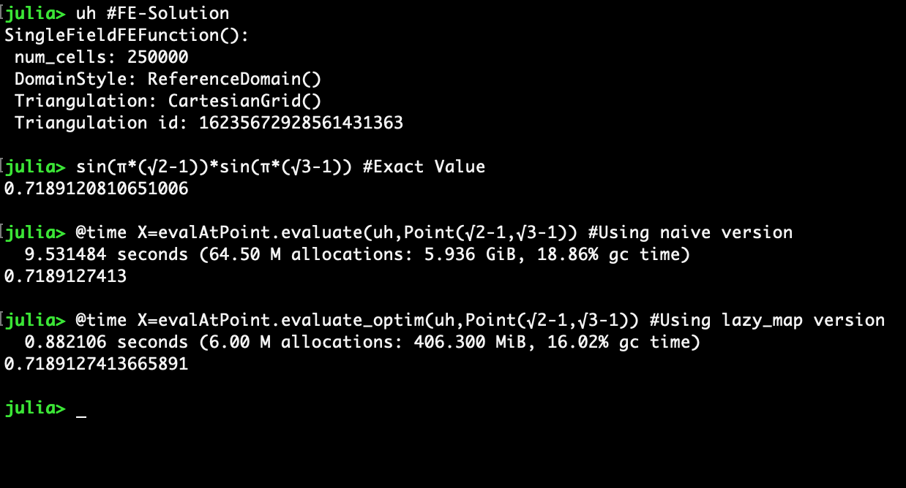

## Ice-shelf problem

### Gridap Example

Solving an example ice-shelf problem with Gridap. Brief description of
the modules are below:

- `dispersion.jl`: Contains functions to compute the roots of the
  dispersion equation. Solving roots of non-linear equations, for
  example

- `FEMSolve.jl`: Contains functions to solve the FEM problems using
  Julia and to build the reduced system. Currently the full
  implementation is available for thin-plate problems. Will be
  extended to linear elasticity.

- `nonLocal.jl`: To obtain the non-local boundary condition on the
  ocean-cavity interface. A robin-type boundary condition, where the
  derivative is related to the potential in the form of an integral
  equation.

- `solver.jl`: Main routine to get the user-data and solve the problem.

### Sample outputs

Some sample outputs showing the displacement of the ice when forced by
a long incident wave. The shelf is rigidly fixed at one end.

|  |  |
| -- | -- |

### Reference

Ilyas, M., Meylan, M. H., Lamichhane, B., & Bennetts,
L. G. (2018). *Time-domain and modal response of ice shelves to wave
forcing using the finite element method.* J. Fluids Struct., 80,
113–131.


## Computing function at a point

`feval.jl` Contains the routines to compute the function at a point.
**Dependency:** `PolygonOps.jl` for locating the polygon in which the
point is located.

- The function
``` Julia
evalAtPoint.evaluate(uh,P)
```
does the operation using a naive approach. Results show the difference
between the computation time.

- The method
``` julia
evalAtPoint.evaluate_optim(uh,P)
```
uses `lazy_map` to perform the computations and hence optimised (There
is definitely room for improvement ...). Dispatch the routine to
```Gridap.evaluate``` using
```julia
Gridap.evaluate(uh::SingleFieldFEFunction, P::Point) = sum(unique(evaluate_optim(uh,P)))
```
**and is done inside `feval.jl`**.

### Example
- Compute the solution on a 500 x 500 cartesian grid.
- Use
```julia
valAtPoint.evaluate(uh,Point(√2-1,√3-1))
```
and compare with
```julia
evalAtPoint.evaluate_optim(uh,Point(√2-1,√3-1))
```
The time taken by the naive approach is ~10x larger than the optimised
version. The bulk of the time is taken by the (external)`inpolygon`
function which is used to find the location of the point in the
discretization. This part of the code could be optimised further ...
|  |
| --

## Interpolating Lagrange elements
