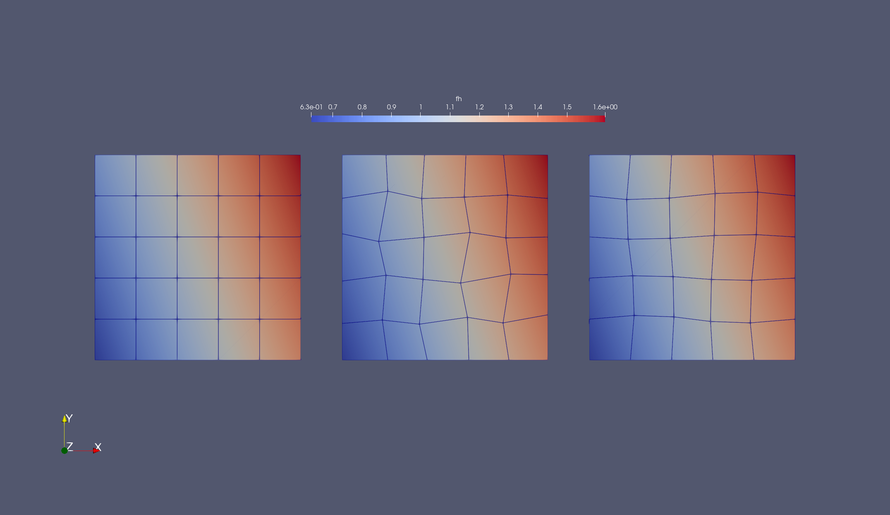
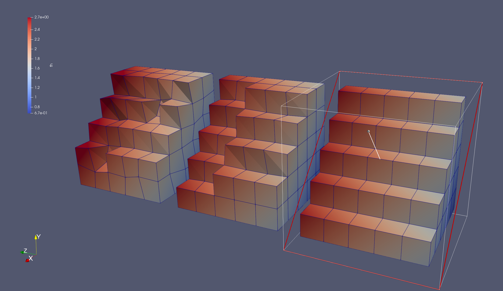

## Gridap GSoC 2021

Contains some code related to my Google Summer of Code. I mostly fill
this up with experiments and to test concepts. Checkout `DETAILS.md`
for more details and also this blog post.

> https://balaje.github.io/2021/05/19/Google-Summer-Code.html

### Evaluating function on an arbitrary point.

Extend `evaluate` to handle arbitrary points. Check this blog post out.
> https://balaje.github.io/2021/06/05/GSoC-Week-0.html

### Use `evaluate` to interpolate between two meshes.

As of now simplest interpolation works. Check these codes:

>- https://github.com/Balaje/GSoC-2021/blob/main/Interpolation/nDinterpolate.jl
>- https://github.com/Balaje/GSoC-2021/blob/main/Interpolation/interpolate.jl

|  |  |
| -- | -- |

There is an error currently where the inverse mapping to convert
points in physical space to reference space fails if the element is
very distorted. So the tests are currently available only for simplest
possible deformation.
