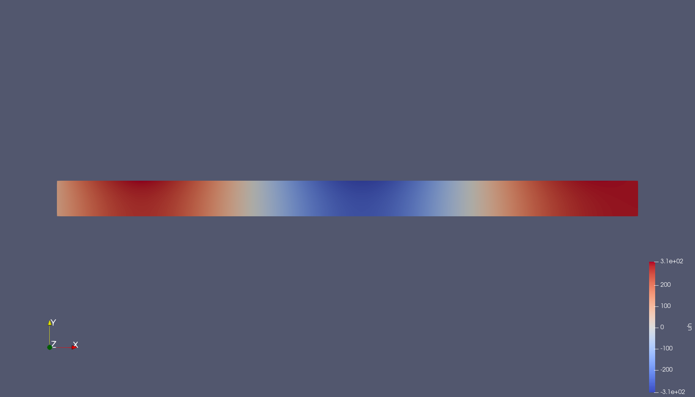
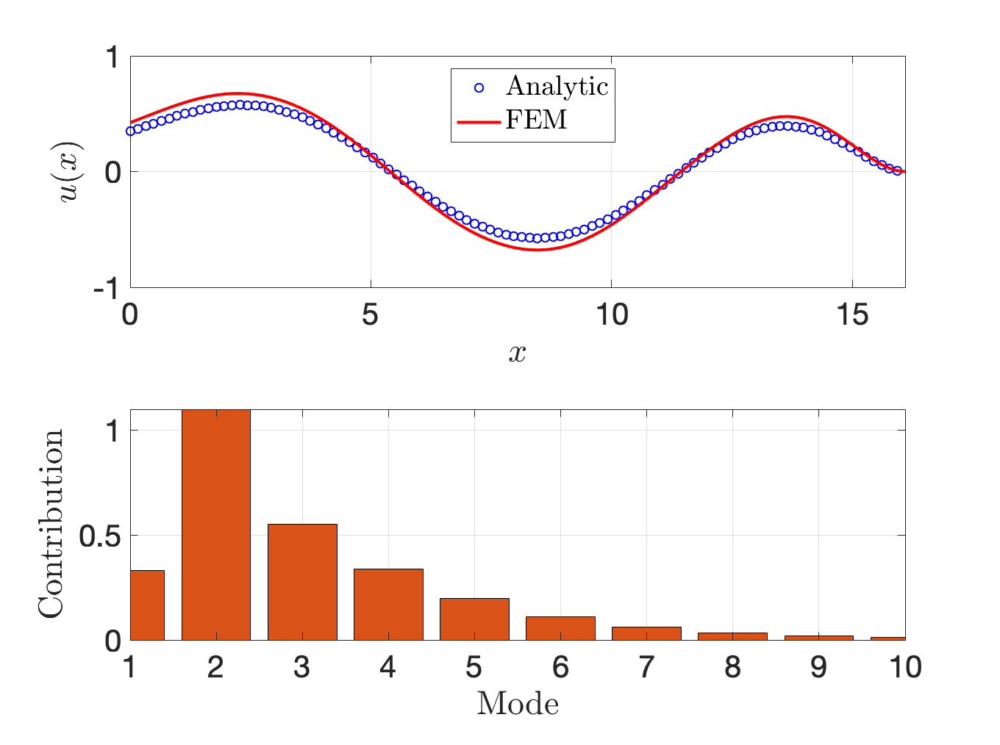

### Gridap Example

Solving an example ice-shelf problem with Gridap. Brief description of the modules are below:

- `dispersion.jl`: Contains functions to compute the roots of the dispersion equation. Solving roots of non-linear equations, for example

- `FEMSolve.jl`: Contains functions to solve the FEM problems using Julia and to build the reduced system. Currently the full implementation is available for thin-plate problems. Will be extended to linear elasticity.

- `nonLocal.jl`: To obtain the non-local boundary condition on the ocean-cavity interface. A robin-type boundary condition, where the derivative is related to the potential in the form of an integral equation.

- `solver.jl`: Main routine to get the user-data and solve the problem.

### Sample outputs

Some sample outputs showing the displacement of the ice when forced by a long incident wave. The shelf is rigidly fixed at one end.

 |  |
-- | -- |

### Reference

Ilyas, M., Meylan, M. H., Lamichhane, B., & Bennetts, L. G. (2018). *Time-domain and modal response of ice shelves to wave forcing using the finite element method.* J. Fluids Struct., 80, 113–131.
